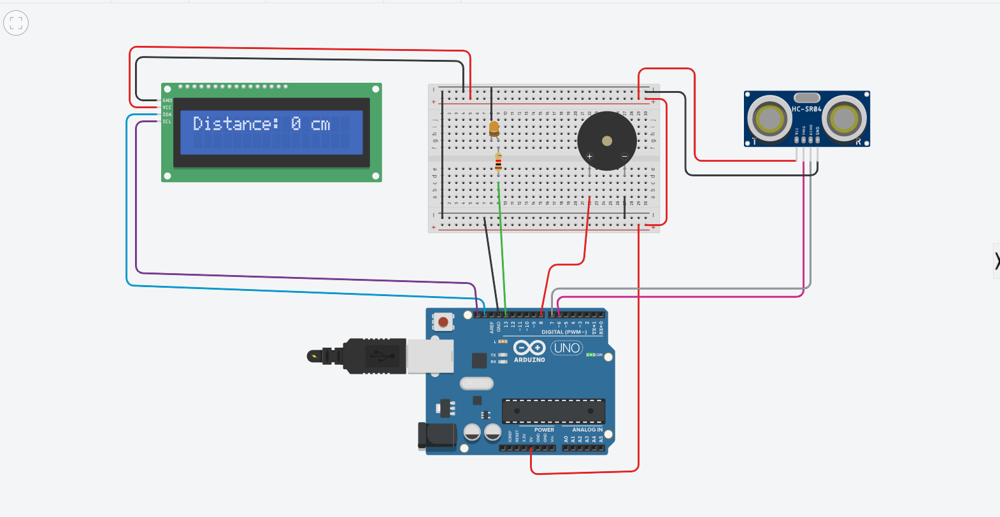

---

# 🔌 Day 2: Introduction to Tinkercad & First Circuit Design Simulation

---

## 🧭 Overview

On the second day, we explored practical skills by working with **Tinkercad**, an online simulation platform used for designing and testing electronic circuits.

---

## 🛠 Introduction to Tinkercad

We were introduced to the features and capabilities of Tinkercad, including:

- Creating and managing projects  
- Using electronic components (LEDs, resistors, Arduino, etc.)  
- Building circuits in a virtual environment  
- Running simulations in real time  

---

## ⚡ First Circuit Design

We designed and simulated our first electronic circuit.

### Activities performed:

- Connecting basic components such as LEDs and resistors  
- Using Arduino for control  
- Writing and uploading code  
- Running simulation to test functionality  

---

## 💡 Sample Arduino Code

// Simple LED Blink Program
int led = 13;

void setup() {
  pinMode(led, OUTPUT);
}

void loop() {
  digitalWrite(led, HIGH);
  delay(1000);
  digitalWrite(led, LOW);
  delay(1000);
}
---

## 🖼 First Circuit Design Preview

Below is the first circuit we designed and simulated using Tinkercad:

